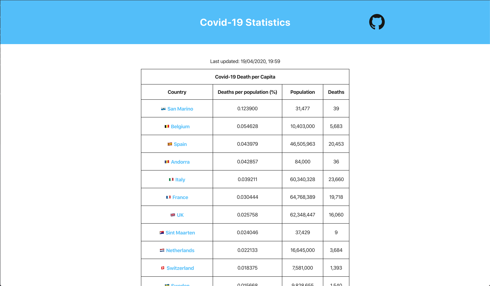
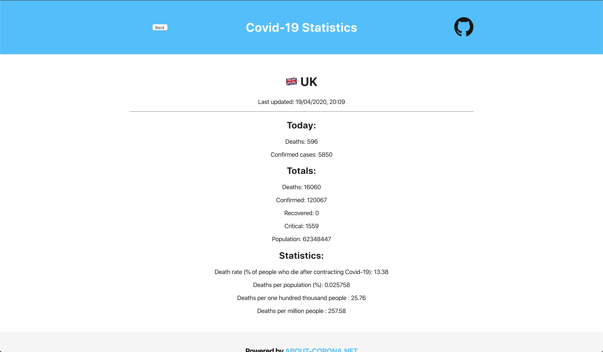

# Covid-19 Statistics 📊

[https://covid-19-statistics-fa1d6.web.app/](https://covid-19-statistics-fa1d6.web.app/)

The purpose of this web app is to provide up to date Covid-19 statistics, including deaths per capita.

Special thanks to [about-corona.net](https://about-corona.net/documentation) for their api.

## Roadmap 🗺️

- Format timeline data and add graph of timeline to countries screen
- Refactor `AllCountriesTable` to `Table` so its more modular
  - Move get request to home screen, then we can re-use for favourites table
- Make it look pretty

## Running locally 🛠️

### `yarn`

Installs dependencies in the local node_modules folder.

### `yarn start`

Runs the app in the development mode. 
Open [http://localhost:3000](http://localhost:3000) to view it in the browser.

The page will reload if you make edits. 
You will also see any lint errors in the console.

## Deployments 🚀

### `yarn deploy`

Builds the app for production to the `build` folder. It bundles React in production mode and optimizes the build for the best performance. The build is minified and the filenames include the hashes.

To deploy the app we use [Firebase deploy](https://firebase.google.com/docs/hosting/deploying).

Once deployed, the updates will be visible [here](https://covid-19-statistics-fa1d6.web.app/).

## Screenshots 📷

### Home Page

### Country Page

